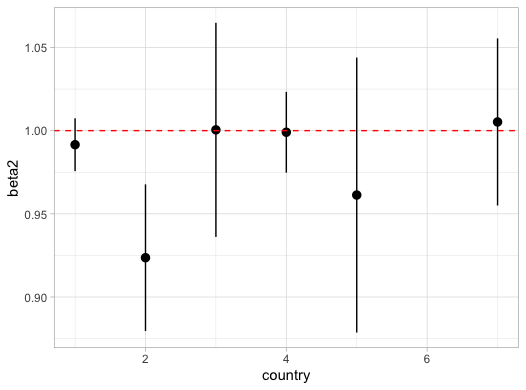
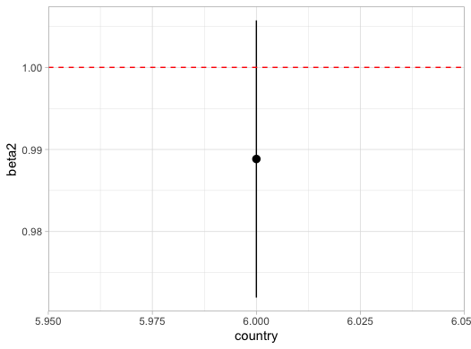
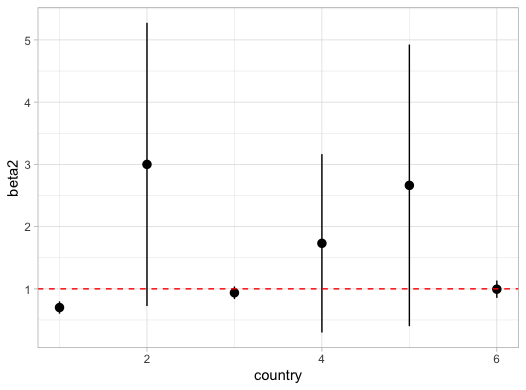

## Project: Exploring the Severity of Different Covid-19 Strains

Track D: Epidemiology Group:D_001

Group member: Aboli Marathe, Ahmed Gobba, Dr. Raouf Hajji, Ruby Zhang,Faith Ilesanmi, Sumin Lan

Our project topic is about discovering which COVID-19 strains have been correlated with the most severe outcomes up to date. We tend to analyze the severity and preparedness of COVID-19 first and then build model to predict the correlation between Strain and severe results.

  
   
  
   

   
