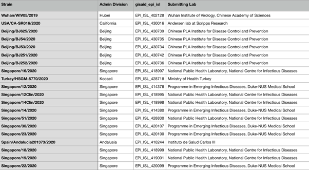

## Project: Exploring the Severity of Different Covid-19 Strains

Track D: Epidemiology Group:D_001

Group members: Aboli Marathe, Ahmed Gobba, Dr. Raouf Hajji, Ruby Zhang,Faith Ilesanmi, Sumin Lan

<h1>Research Questions</h1> 
  What are the the different clusters (lineages) of COVID-19 strains?  
  Which of these lineages (if any) are most correlated with outcome severity? 
  
 <h1>Data Sample</h1>  
   
<h1>Visualization</h1> 
  <h1>Data<h1> 
   
  
  <h1>Model<h1> 
   
  
   

   
  
  <h1>CONCLUSIONS</H1>
  The impact of the COVID-19 outbreak can be curtailed with:
The distance between lineages falls between (0.00 - 0.02) and is insufficient to consider them as different genotypes.
There is no significant difference in the association between each of the lineages and severity of outcome.  

